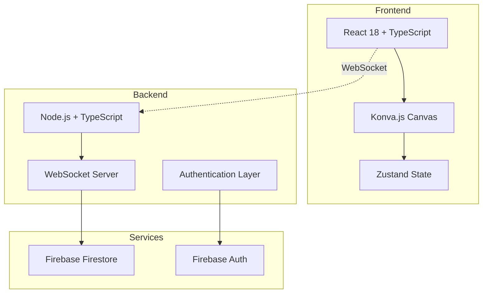

# CollabCanvas 🎨

> **Real-time collaborative design made simple**

A powerful, real-time collaborative canvas application that enables teams to create, edit, and brainstorm together seamlessly. Built with modern web technologies and designed for both performance and user experience.

[](https://co-canvas.netlify.app/)
[](https://reactjs.org/)
[](https://www.typescriptlang.org/)
[](https://firebase.google.com/)
[](https://netlify.com/)
[](https://railway.app/)

---

## ✨ What is CollabCanvas?

CollabCanvas transforms the way teams collaborate on visual projects. Whether you're brainstorming ideas, creating wireframes, or building diagrams, CollabCanvas provides an infinite digital whiteboard where multiple people can work simultaneously in real-time.

**Perfect for:**
- 🏢 **Teams** conducting remote brainstorming sessions
- 🎓 **Educators** creating interactive lessons
- 🎨 **Designers** collaborating on wireframes and mockups
- 📊 **Project Managers** visualizing workflows and processes

---

## 🚀 Key Features

### 🎯 **Real-time Collaboration**
- **Live multiplayer editing** - See changes from all team members instantly
- **Smart conflict resolution** - Never lose work when multiple people edit simultaneously
- **Sub-100ms sync latency** - Changes appear almost instantaneously

### 👥 **Rich Presence Awareness**
- **Live cursors** with user names and colors
- **User avatars** displayed in the toolbar
- **Active tool indicators** showing what each person is currently using
- **Join/leave notifications** to track team activity

### 🛠️ **Powerful Canvas Tools**
- **Infinite workspace** (10,000 x 10,000px minimum) with smooth pan and zoom
- **Shape creation**: Rectangles, circles, and text objects
- **Customizable styling**: Colors, fonts, and sizes
- **Intuitive editing**: Double-click text to edit, drag objects to move

### 🔐 **Flexible Authentication**
- **Google OAuth** for quick social login
- **Email/Password** for traditional authentication
- **Persistent user profiles** with customizable avatars

### 💾 **Smart Data Persistence**
- **Auto-save functionality** - Your work is never lost
- **Session recovery** - Rejoin and see all previous work intact
- **Cross-device sync** - Access your canvas from anywhere

---

## 🌐 Live Demo

**Try it now:** [co-canvas.netlify.app](https://co-canvas.netlify.app/)

*Experience real-time collaboration by opening the demo in multiple browser windows!*

---

## 🏗️ Technical Architecture

CollabCanvas is built with a modern, scalable architecture designed for performance and reliability:



### 🛠️ Technology Stack

**Frontend:**
- **React 18** with TypeScript for type-safe, modern UI development
- **Konva.js** for high-performance 2D canvas rendering
- **Zustand** for lightweight, efficient state management
- **Tailwind CSS** for responsive, utility-first styling

**Backend:**
- **Node.js** with TypeScript for server-side logic
- **WebSocket** server for real-time communication
- **Express.js** for RESTful API endpoints

**Database & Authentication:**
- **Firebase Firestore** for real-time database synchronization
- **Firebase Authentication** supporting Google OAuth and email/password

**Deployment & Infrastructure:**
- **Netlify** for frontend hosting with global CDN
- **Railway** for backend deployment
- **Automated CI/CD** with GitHub Actions

---

## 🚦 Getting Started

### Prerequisites

- **Node.js** 18+ 
- **npm** or **yarn**
- **Firebase project** (for authentication and database)

### Quick Setup

1. **Clone the repository**
   ```bash
   git clone https://github.com/yourusername/collab-canvas.git
   cd collab-canvas
   ```

2. **Install dependencies**
   ```bash
   # Frontend
   cd frontend
   npm install
   
   # Backend
   cd ../backend
   npm install
   ```

3. **Configure environment variables**
   ```bash
   # Frontend (.env)
   cp frontend/env.example frontend/.env
   # Add your Firebase configuration
   
   # Backend (.env)
   cp backend/env.example backend/.env
   # Add your Firebase Admin SDK configuration
   ```

4. **Start development servers**
   ```bash
   # Terminal 1 - Backend
   cd backend && npm run dev
   
   # Terminal 2 - Frontend  
   cd frontend && npm run dev
   ```

5. **Open your browser**
   
   Navigate to `http://localhost:5173` and start collaborating!

### Firebase Configuration

1. Create a [Firebase project](https://console.firebase.google.com/)
2. Enable **Firestore Database** and **Authentication**
3. Add **Google** and **Email/Password** sign-in methods
4. Copy your configuration to the `.env` files

---

## 📖 Usage Guide

### Creating Your First Canvas

1. **Sign in** using Google OAuth or email/password
2. **Create shapes** using the toolbar:
   - 🔳 **Rectangle tool** - Click and drag to create rectangles
   - ⭕ **Circle tool** - Click and drag to create circles  
   - 📝 **Text tool** - Click to add text, double-click to edit
3. **Customize** colors using the color picker
4. **Move objects** by clicking and dragging
5. **Invite collaborators** by sharing the room URL

### Collaboration Features

- **See live cursors** of other users with their names
- **Watch real-time edits** as they happen
- **Get notified** when users join or leave
- **Resolve conflicts** automatically with visual feedback

---

## 🔧 Development

### Project Structure

```
collab-canvas/
├── frontend/                 # React TypeScript frontend
│   ├── src/
│   │   ├── components/      # React components
│   │   ├── hooks/           # Custom React hooks
│   │   ├── store/           # Zustand state management
│   │   ├── services/        # API services
│   │   └── types/           # TypeScript types
│   └── package.json
├── backend/                  # Node.js TypeScript backend
│   ├── src/
│   │   ├── handlers/        # WebSocket message handlers
│   │   ├── services/        # Business logic services
│   │   ├── websocket/       # WebSocket server setup
│   │   └── config/          # Configuration files
│   └── package.json
└── README.md
```

### Available Scripts

**Frontend:**
```bash
npm run dev          # Start development server
npm run build        # Build for production
npm run preview      # Preview production build
npm run test         # Run tests
npm run lint         # Lint code
```

**Backend:**
```bash
npm run dev          # Start with hot reload
npm run build        # Compile TypeScript
npm run start        # Start production server
npm run test         # Run tests
```

### Testing Strategy

CollabCanvas includes comprehensive testing:

- **Unit Tests** - Jest/Vitest for component and utility functions
- **Integration Tests** - WebSocket communication and state management
- **End-to-End Tests** - Cypress for complete user workflows
- **Performance Tests** - 60 FPS and <100ms sync validation

```bash
# Run all tests
npm run test

# Run E2E tests
npm run test:e2e

# Run performance tests
npm run test:performance
```

---

## 🚀 Deployment

### Production Deployment

**Frontend (Netlify):**
```bash
npm run build
netlify deploy --prod --dir=dist
```

**Backend (Railway):**
```bash
npm run build
# Deploy using Railway CLI or GitHub integration
```

### Environment Variables

Ensure the following environment variables are set in production:

**Frontend:**
- `VITE_FIREBASE_API_KEY`
- `VITE_FIREBASE_AUTH_DOMAIN`
- `VITE_FIREBASE_PROJECT_ID`
- `VITE_WEBSOCKET_URL`

**Backend:**
- `FIREBASE_ADMIN_SDK_JSON`
- `PORT`
- `NODE_ENV`

---

## 📊 Performance Metrics

CollabCanvas is optimized for performance:

- **🎯 60 FPS** maintained during object manipulation
- **⚡ <100ms** object synchronization latency
- **🚄 <50ms** cursor position updates
- **👥 5+ users** supported without performance degradation
- **🔄 Zero data loss** during disconnects/reconnects

---

## 🤝 Contributing

We welcome contributions! Please see our [Contributing Guidelines](CONTRIBUTING.md) for details.

1. **Fork** the repository
2. **Create** a feature branch (`git checkout -b feature/amazing-feature`)
3. **Commit** your changes (`git commit -m 'Add amazing feature'`)
4. **Push** to the branch (`git push origin feature/amazing-feature`)
5. **Open** a Pull Request

### Development Workflow

- Follow **conventional commits** for clear git history
- Write **tests** for new features
- Ensure **type safety** with TypeScript
- Run **linting** before committing
- Update **documentation** for API changes

---

## 📋 Roadmap

- [ ] **AI Canvas Agent** - Smart suggestions and automated drawing
- [ ] **Advanced Selection** - Multi-select and drag-select capabilities  
- [ ] **Layer Management** - Organize objects in layers
- [ ] **Shape Resizing** - Resize handles for all objects
- [ ] **Export Features** - Save as PNG, PDF, SVG
- [ ] **Template Library** - Pre-built templates for common use cases
- [ ] **Mobile App** - Native iOS and Android applications

---

## 📄 License

This project is licensed under the MIT License - see the [LICENSE](LICENSE) file for details.

---

## 🙏 Acknowledgments

- **Konva.js** for powerful 2D canvas rendering
- **Firebase** for reliable real-time infrastructure  
- **Netlify** for seamless frontend deployment and hosting
- **Railway** for reliable backend hosting
- **The React community** for amazing tools and libraries

---

<div align="center">

**Built with ❤️ by Rasheed Lewis**

[🌐 Live Demo](https://co-canvas.netlify.app/) • [📧 Contact](mailto:me@rasheedlewis.com) • [🐦 Twitter](https://twitter.com/RasheedLLewis)

⭐ **Star us on GitHub** if you find CollabCanvas useful!

</div>
